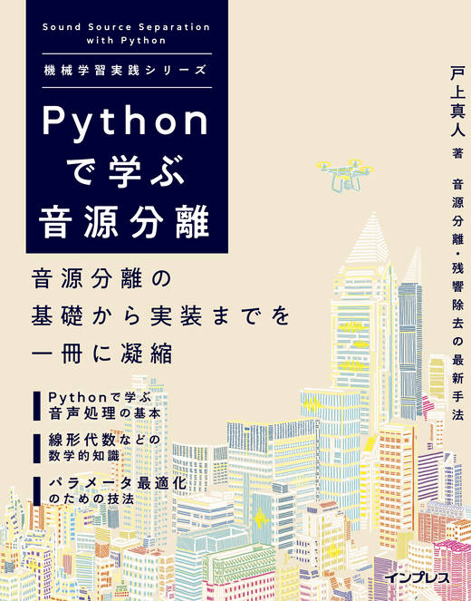

# Pythonで学ぶ音源分離（機械学習実践シリーズ）のソースコード

本リポジトリでは、インプレス社機械学習実践シリーズの「Pythonで学ぶ音源分離」のサンプルコードを管理しています。

## 書籍概要

* [Pythonで学ぶ音源分離（機械学習実践シリーズ）](https://book.impress.co.jp/books/1119101154)
* 価格: 3,500円+税
* 発売日: 2020年8月24日
* ページ数: 352
* サイズ: B5変形判
* 著者: 戸上 真人
* ISBN: 9784295009849

## 目次

* 序章
* 第1章 音源分離とは？
* 第2章 音声処理の基礎
* 第3章 音源分離で用いる数学的知識の基礎（線形代数、ベクトル・行列の微分）
* 第4章 「最適化」に関する技法を理解する
* 第5章 シミュレーターで音を作ってみる
* 第6章 古典的な音源分離方法～ビームフォーミング～
* 第7章 音源方向推定に基づく音源分離
* 第8章 現代的な統計的モデルに基づく音源分離法
* 第9章 響きのある音を響きのない音に変える残響除去法
* 第10章 音源分離と残響除去を統合的に実行する
* 第11章 音源分離関連のライブラリ紹介・その他のトピック・参考文献

## 各章のサンプルコード

* [本書の前提](md/install.md)
* [第2章のサンプルコード](md/section2.md)
* [第3章のサンプルコード](md/section3.md)
* [第4章のサンプルコード](md/section4.md)
* [第5章のサンプルコード](md/section5.md)
* [第6章のサンプルコード](md/section6.md)
* [第7章のサンプルコード](md/section7.md)
* [第8章のサンプルコード](md/section8.md)
* [第9章のサンプルコード](md/section9.md)
* [第10章のサンプルコード](md/section10.md)
* [第11章のサンプルコード](md/section11.md)

## 訂正

[本書の正誤表](md/errata.md)
